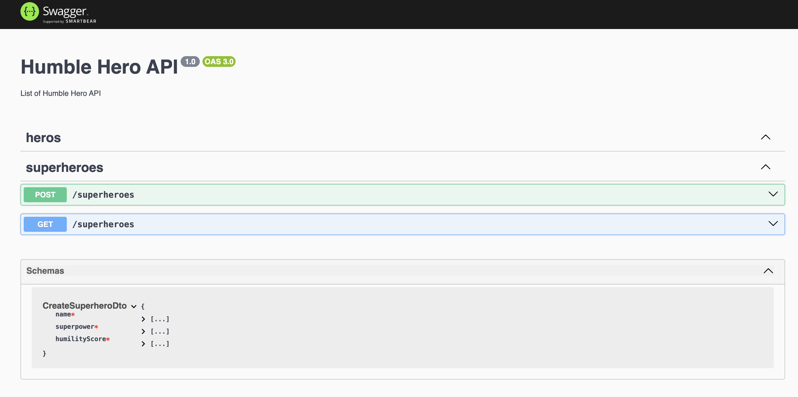

# Humblify - Superhero API



## Overview
This project is a NestJS-based API for managing superheroes. It includes structured modules, controllers, services, DTOs, and models with validation, along with Swagger documentation and test cases.

## Prerequisites
Before running the project, ensure you have the following installed:
- Node.js (>= 18.x)
- npm (>= 9.x) or yarn

### Codebase Structure
| Folder/File | Description |
|------------|-------------|
| `src/main.ts` | Entry point of the application. Boots up the NestJS app. |
| `src/app.module.ts` | Root module that imports all feature modules. |
| `src/dto/` | Contains DTOs for validating incoming requests. |
| `src/models/` | Defines TypeScript models representing database entities. |
| `src/controllers/` | Contains controllers handling HTTP routes and requests. |
| `src/services/` | Business logic and application functionalities. |
| `src/config/swagger.config.ts` | Configures Swagger API documentation. |
| `src/test/` | Includes unit and e2e test cases. |

## Overview
<details open>
<summary>Superhero Module</summary>

### Superhero Module Components
| Component | Description |
|-----------|-------------|
| `superhero.module.ts` | Registers controller and service. |
| `superhero.controller.ts` | Defines REST endpoints for superhero operations. |
| `superhero.service.ts` | Implements business logic. |
| `superhero.model.ts` | Defines the Superhero entity. |
| `dto/create-superhero.dto.ts` | Defines data validation for creating a superhero. |
</details>

<details open>
<summary>Superhero Controller</summary>

### Superhero Controller (`superhero.controller.ts`)
| Method | Endpoint | Description |
|--------|---------|-------------|
| `@Post()` | `/superheroes` | Adds a new superhero. |
| `@Get()` | `/superheroes` | Retrieves superheroes with optional pagination. |

</details>

<details open>
<summary>Superhero Service</summary>

### Superhero Service (`superhero.service.ts`)
| Method | Description |
|--------|-------------|
| `addSuperhero(dto: CreateSuperheroDto)` | Adds a new superhero. |
| `getSuperheroes(page: number, limit: number)` | Retrieves superheroes sorted by humility score. |

</details>

<details open>
<summary>Superhero DTO</summary>

### DTO (`create-superhero.dto.ts`)
| Field | Type | Description |
|--------|------|-------------|
| `name` | `string` | Name of the superhero (required). |
| `superpower` | `string` | Superpower of the superhero (required). |
| `humilityScore` | `number` | Humility score (1-10, required). |

</details>

<details open>
<summary>Superhero Model</summary>

### Model (`superhero.model.ts`)
| Field | Type | Description |
|--------|------|-------------|
| `name` | `string` | Name of the superhero. |
| `superpower` | `string` | Superpower description. |
| `humilityScore` | `number` | Score ranging from 1 to 10. |

</details>

## API Reference

#### Get all heros

```http
  GET /superheroes
```

| Query Param | Type     | Description                |
| :-------- | :------- | :------------------------- |
| `page` | `int` | **Optional**. Page Number |
| `limit` | `int` | **Optional**. Number of records |

#### Add superhero

```http
  POST /superheroes
```

| Body Parameter | Type     | Description                       |
| :-------- | :------- | :-------------------------------- |
| `name`      | `string` | **Required**. Name |
| `superpower`| `string` | **Required**. Superpower of hero |
| `humilityScore`| `string` | **Required**. Score b/w 1 to 10 |

## Swagger Documentation
The API is documented using Swagger.
- Run the application and visit `/api` to explore the API documentation.
- Configured in `src/config/swagger.config.ts`.

## Running the Application
1. Install dependencies:
```sh
yarn install
   ```
2. Start the application:
```sh
yarn run start:dev
# OR
yarn run start:debug
# OR
yarn run start:prod
```

## Running Tests
- Run unit tests:
```sh
yarn run test
```
- Run e2e tests:
```sh
yarn run test:e2e
```

## Linting & Formatting
Ensure code consistency by running:

```sh
npm run lint  # Run ESLint with auto-fix
npm run format  # Format code with Prettier
```

